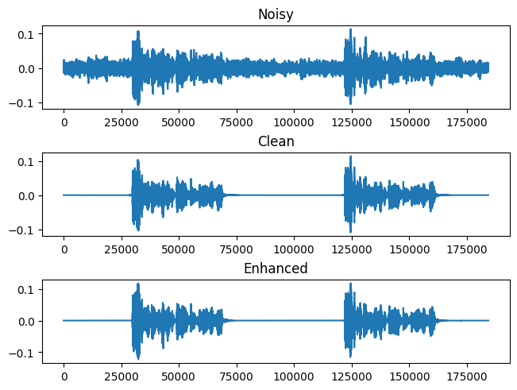

# 2023 ICASSP Clarity Challenge for Speech enhancement with hearing aid

@author daniel.oh

@data   2023.03.30

## 1. Summary    
This repository is for the 2023 ICASSP Clarity Challenge for Speech enhancement with hearing aid. It used two addtional repository, which are [ML model for speech enhancment](https://github.com/ooshyun/Speech-Enhancement-Pytorch) and [Hearing aid modules](https://github.com/ooshyun/Speech-Enhancement-Pytorch).
The main model is [Conv-Tasnet](https://ieeexplore.ieee.org/abstract/document/8707065) using [Permutation Invariant Training(PIT)](https://ieeexplore.ieee.org/abstract/document/7979557).


## 2. Baseline
Before starting, it clone a git from https://github.com/ooshyun/Speech-Enhancement-Pytorch as "mllib" folder, and added ./recipes/icassp_2023/MLbaseline.

- Clarity Challenge 2023 Main page     : https://claritychallenge.org/docs/icassp2023/icassp2023_intro
- Clarity Challenge 2023 Github        : https://github.com/claritychallenge/clarity/

### 2.1 Evalaute (clarity/receipes/icassp_2023/baseline)
- clarity/receipes/icassp_2023/baseline/enhance.py: It processes from each mixture sound depending on scene name to denoised and save as wav file. From this file, participants should implement their own enhanced mechnism.
    
- clarity/receipes/icassp_2023/baseline/evaluate.py: It processes from each enhanced sound to amplify and compress, and score the sound using clean sound and "anechoic"(deverbersed) sound using haspi/hasqi metric. These score saved as 
.csv files.

- clarity/receipes/icassp_2023/baseline/report.py: It load .csv file and avergage haspi/hasqi scores

### 2.2 Dataset
- SOXXXX: Scene name
    - XXX_mix_XXX.wav : several person and target person
    - XXX_interferer_XXX.wav: several person
    - XXX_target_XXX.wav: clean sound for target
    - XXX_anechoic_XXX.wav: sounds free from echo for target

- L0XXXX: Listeners ID, which can load hearing loss
- [Tree of dataset folder](./result/Tree-Dataset.md)

### 2.3 Pipeline

1. Dataset
2. Dataloader
3. trainer 
4. [model](https://github.com/ooshyun/Speech-Enhancement-Pytorch)
5. evalutation 
6. submission file    

- Used library: julius,librosa, torchaudio

### 2.4 Model Research
- The model is [Conv-Tasnet](https://ieeexplore.ieee.org/abstract/document/8707065) using [Permutation Invariant Training(PIT)](https://ieeexplore.ieee.org/abstract/document/7979557) with Pytorch.

- DCUnet, 2018: 
    - https://github.com/pheepa/DCUnet
    - https://github.com/sweetcocoa/DeepComplexUNetPyTorch

- DeepComplexCRN: https://github.com/huyanxin/DeepComplexCRN

- Wave-U-Net: 
    - https://github.com/f90/Wave-U-Net
    - https://github.com/haoxiangsnr/Wave-U-Net-for-Speech-Enhancement

- CRNN: https://github.com/haoxiangsnr/A-Convolutional-Recurrent-Neural-Network-for-Real-Time-Speech-Enhancement

- Conv-tasnet
    - Origin: https://github.com/naplab/Conv-TasNet
    - Demus: https://github.com/facebookresearch/demucs/tree/v2

- Demucs(Implemented in Pytorch)
    - drums, bass, vocal, others
    - denoiser: https://github.com/facebookresearch/denoiser
    - demucs: https://github.com/facebookresearch/demucs
        - Demucs v2
        - Demucs v3
        - Transformer

- Conformer GAN: https://github.com/ruizhecao96/CMGAN
- SEGAN: https://github.com/santi-pdp/segan
- Dual-signal Transfomration LSTM: https://github.com/breizhn/DTLN
- Full subnet: https://github.com/haoxiangsnr/FullSubNet

- Previous MS Noise Suppression, open-source
    - https://www.isca-speech.org/archive/interspeech_2020/westhausen20_interspeech.html
    - https://github.com/echocatzh/MTFAA-Net

## 3. Results
If want to test 3 models, then it should change manully model parameter in [./mllib/src/model/conv_tasnet.py](https://github.com/ooshyun/Speech-Enhancement-Pytorch/blob/master/src/model/conv_tasnet.py)

### 3.1 Parameters
- Reference. https://github.com/JusperLee/Conv-TasNet/tree/9eac70d28a5dba61172ad39dd9fb90caa0d1a45f
- 1 epoch: 316+56 step
- randomly cropping the wavform
- dataset channel 0, 1, 2, 3
- skip: False
- segment 4
- norm z-score
- Utterance-level Permuatation Invariant Training (uPIT)

- Saved Model
    ```
    - 20230220-100114
        - 	N, 	L, 	 B,   H, P, X, R, Norm, Casual, batch
        - 128, 40, 128, 256, 3, 7, 2,  gLN,   X,     16             

    - 20230221-231507
        - 	N, 	L, 	 B,   H, P, X, R, Norm, Casual, batch
        - 512, 	32 	128, 512  3  8  3   gLN    X 	  4

    - 20230223-140053
        - 	N, 	L, 	 B,   H, P, X, R, Norm, Casual, batch
        - 512, 	40 	128, 512  3  8  4   gLN    X 	  4
    ```
### 3.2 Denoise
The details of results can show in [./tensorboard](./tensorboard), and it prepared to inference noisy sound file to denoise using inference.ipynb and conv-tasnet in result/model.
- (20230221-231507) Wavform, S03488_target_CH1

    

- (20230221-231507) Spectrograms, S03488_target_CH1

    

- (20230221-231507) Audio, S03488_target_CH1
    [TODO]

    
## 4. Concepts in Clarity Challenge
### 4.1 Amplification
- NAL-R
- Each freqeuncy gain, bias, Each freqeuncy/HL bias, hl*0.31 gain
- interpolate 1D

### 4.2 Compression
- att 5, release 20, attenuate 0.0001, threshold 1, makeup gain 1, 
- Compression depending on the rms
    ```python
    if rms_i > self.threshold:
        temp_comp = (rms_i * self.attenuation) + (
            (1 - self.attenuation) * self.threshold
        )
        curr_comp = (curr_comp * (1 - self.attack)) + (temp_comp * self.attack)
    else:
        curr_comp = (1 * self.release) + curr_comp * (1 - self.release)
    
    ...

    signal * np.array(comp_ratios) * self.makeup_gain
    ```

### 4.3 HASPI
- x: original, y: amplified
1. Ear Model
    - itype = 0, channel = 32
    1. Cochlear model parameters
    2. itype = 0, HL = 0 else HL = HL
    3. resample 24kHz(Resamp24kHz, diff length of result with resampy resampe)
    4. align processed and original
    5. [HASQI] amplified using NALR
    6. Cochlear model for middle ear(LP 5000Hz, HP 350Hz)
    7. Auditory filter bank for each channel
        - Gamma Tone band (middle ear, Max HL BW)
        - Cochlear compression

2. Envelop filter
3. Ceptral Coeffcient
4. Modulate Filter
5. Correlation
6. Neural Feedforward

### 4.4 HASQI
1. Ear Model: itype = 1(NALR gain apply)
2. Smoothing
3. Mel Correlation(Ceptral correlation)
4. spectral differiate(log-term spectra)
4. Temporal Correlation
5. Segment cross-covariance
6. nonlinear/linear performance
7. nonlinear*linear -> max of middle of nonlinear * middle of linear

## 5. Reference
*The details for reference is on the each python files.  
- [Conv-Tasnet](https://ieeexplore.ieee.org/abstract/document/8707065)  
- [Permutation Invariant Training(PIT)](https://ieeexplore.ieee.org/abstract/document/7979557)