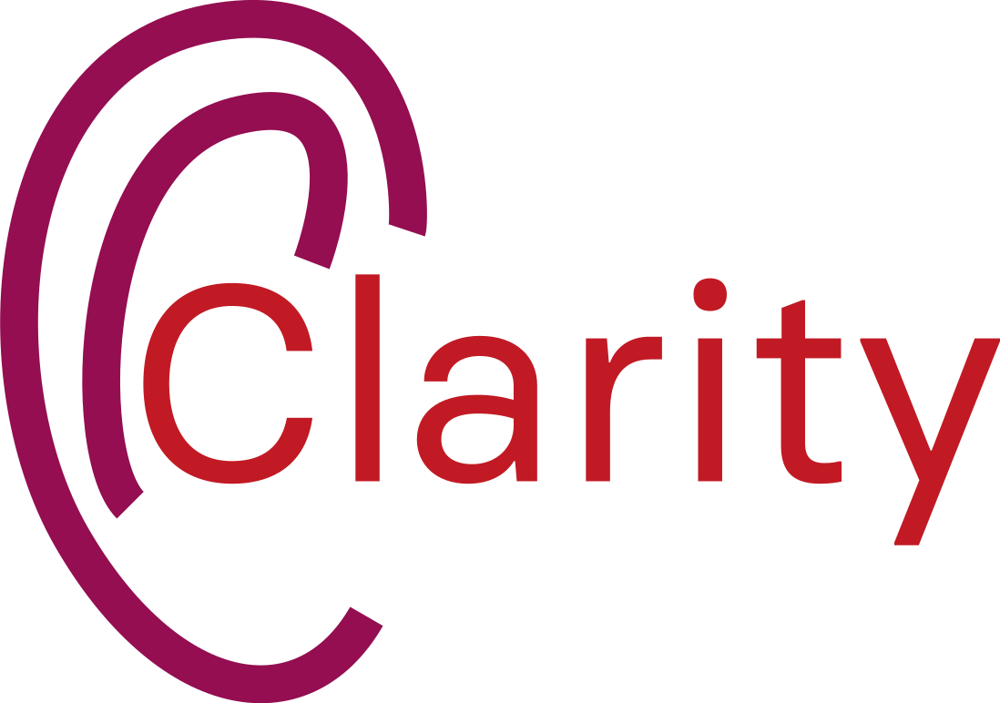
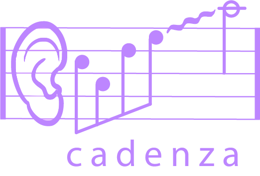

## Machine learning challenges for hearing aid processing.
<p align="center">
  
  
</p>

*This repository is from v0.2.0 in https://github.com/claritychallenge/clarity.git, and add speech enhancement model

We are organising a series of machine learning challenges to enhance hearing-aid signal processing and to better predict
how people perceive speech-in-noise (Clarity) and speech-in-music (Cadenza). For further details of the Clarity Project
visit [the Clarity project website](http://claritychallenge.org/), and for details of our latest Clarity challenges
visit our [challenge documentation site](https://claritychallenge.github.io/clarity_CC_doc/). You can contact the
Clarity Team by email at [claritychallengecontact@gmail.com](claritychallengecontact@gmail.com). For further details of
the Cadenza Project visit [the Cadenza project website](http://cadenzachallenge.org/), and to find out about the latest
Cadenza challenges join the [Cadenza Challenge Group](https://groups.google.com/g/cadenza-challenge).

In this repository, you will find code to support all Clarity and Cadenza Challenges, including baselines, toolkits, and
systems from participants. **We encourage you to make your system/model open source and contribute to this repository.**

### The 2nd Clarity Enhancement Challenge (CEC2) Online Workshop [Register Now!](https://claritychallenge.org/clarity2022-CEC2-workshop/):fire::fire::fire:

## Installation


### PyPI

Clarity is available on the [Python Package Index (PyPI)](https://pypi.org/project/pyclarity) to install create and/or
activate a virtual environment and then use `pip` to install.

``` bash
conda create --name clarity python=3.8
conda activate clarity

pip install pyclarity
```

### GitHub Cloning

```bash
# First clone the repo
git clone https://github.com/claritychallenge/clarity.git
cd clarity

# Second create & activate environment with conda, see https://docs.conda.io/projects/conda/en/latest/user-guide/install/index.html
conda create --name clarity python=3.8
conda activate clarity

# Last install with pip
pip install -e .
```

### GitHub pip install

Alternatively `pip` allows you to install packages from GitHub sources directly. The following will install the current
`main` branch.

``` bash
pip install -e git+https://github.com/claritychallenge/clarity.git@main
```

## Challenges

Current challenge(s)

- [The 2nd Clarity Enhancement Challenge (CEC2)](./recipes/cec2)

Upcoming challenges

- The first Cadenza Challenge will launch Spring 2023. Join the [Cadenza Challenge
  Group](https://groups.google.com/g/cadenza-challenge) to keep up-to-date on developments.

Previous challenges

- [The 1st Clarity Prediction Challenge (CPC1)](./recipes/cpc1)
- [The 1st Clarity Enhancement Challenge (CEC1)](./recipes/cec1)


## Available tools

We provide also a number of tools in this repository:
- **Hearing loss simulation**
    - [Cambridge MSBG hearing loss simulator](./clarity/evaluator/msbg): descriptions can be found in the [CEC1
      description](./recipes/cec1); an usage example can be found in the [CEC1 baseline](./recipes/cec1/baseline)
      evaluation script `evaluate.py`.
- **Objective intelligibility measurement**
    - [Modified binaural STOI (MBSTOI)](./clarity/evaluator/mbstoi/mbstoi.py): a python implementation of MBSTOI. It is
      jointly used with the MSBG hearing loss model in the [CEC1 baseline](./recipes/cec1/baseline). The official matlab
      implementation can be found here: http://ah-andersen.net/code/
    - [Hearing-aid speech perception index (HASPI)](./clarity/evaluator/haspi/haspi.py): a python implementation of
      HASPI Version 2, and the better-ear HASPI for binaural speech signals. For official matlab implementation, request
      here: https://www.colorado.edu/lab/hearlab/resources
- **Hearing aid enhancement**
    - [Cambridge hearing aid fitting (CAMFIT)](./clarity/enhancer/gha/gainrule_camfit.py): a python implementation of
      CAMFIT, translated from the [HörTech Open Master Hearing Aid (OpenMHA)](http://www.openmha.org/about/); the CAMFIT
      is used together with OpenMHA enhancement as the [CEC1 baseline](./recipes/cec1/baseline), see `enhance.py`.
    - [NAL-R hearing aid fitting](./clarity/enhancer/nalr.py): a python implementation of NAL-R prescription fitting. It
      is used as the [CEC2 baseline](./recipes/cec2/baseline), see `enhance.py`.

In addition, differentiable approximation to some tools are provided:

* [x] [Differentiable MSBG hearing loss model](./clarity/predictor/torch_msbg.py). See also the BUT implementation:
      https://github.com/BUTSpeechFIT/torch_msbg_mbstoi
* [ ] Differentiable HASPI (coming)


## Open-source systems
- CPC1:
  - [Exploiting Hidden Representations from a DNN-based Speech Recogniser for Speech Intelligibility Prediction in
    Hearing-impaired Listeners](./recipes/cpc1/e032_sheffield)
  - [Unsupervised Uncertainty Measures of Automatic Speech Recognition for Non-intrusive Speech Intelligibility
    Prediction](./recipes/cpc1/e029_sheffield)
- CEC1:
  - [A Two-Stage End-to-End System for Speech-in-Noise Hearing Aid Processing](./recipes/cec1/e009_sheffield)


## Implementatio ML Model written by Daniel

Before starting, it clone a git from https://github.com/ooshyun/Speech-Enhancement-Pytorch as "mllib" folder, and added ./recipes/icassp_2023/MLbaseline.

- Clarity Challenge 2023 Main page     : https://claritychallenge.org/docs/icassp2023/icassp2023_intro
- Clarity Challenge 2023 Github        : https://github.com/claritychallenge/clarity/

### Baseline

1. Processing file (clarity/receipes/icassp_2023/baseline)
  - clarity/receipes/icassp_2023/baseline/enhance.py: It processes from each mixture sound depending on scene name to denoised and save as wav file. From this file, participants should implement their own enhanced mechnism.
      
  - clarity/receipes/icassp_2023/baseline/evaluate.py: It processes from each enhanced sound to amplify and compress, and score the sound using clean sound and "anechoic"(deverbersed) sound using haspi/hasqi metric. These score saved as 
  .csv files.

  - clarity/receipes/icassp_2023/baseline/report.py: It load .csv file and avergage haspi/hasqi scores

### Dataset
- SOXXXX: Scene name
    - XXX_mix_XXX.wav : several person and target person
    - XXX_interferer_XXX.wav: several person
    - XXX_target_XXX.wav: clean sound for target
    - XXX_anechoic_XXX.wav: sounds free from echo for target

- L0XXXX: Listeners ID, which can load hearing loss

- the details of data
  ```
  clarity_data/train
      interferers
          music
          noise
          speech
      rooms
          ac
          HOA_IRs
          rpf
      scenes
      targets
  
  metadata/
      hrir_data.json
          selected_channels
          matrix
          weights

      listeners.json			
          name
          audiogram_cfs
          audiogram_levels_l
          audiogram_levels_r

      masker_music_list.json
          track
          artist
          album
          file
          duration
          dataset
          fs
          type
          license
          nsamples

      masker_nonspeech_list.json	
          ID
          class(noise type)
          source
          file
          dataset
          type
          nsamples
          duration
          fs

      rooms.dev.json	
          name
          dimenstions
          target
              positions
              view_vector
          lister
              positions
              view_vector
          interferers
              positions
              view_vector

      scenes.train.json, scenes.dev.json
          dataset
          room
          scence
          target
              name
              time_start
              time_end
          duration
          interferers(1, 2, 3 position, selective ex. 1, 3 /1, 2, / 1, 2, 3)
              position
              time_start
              time_end
              type
              name
              offset
          SNR
          listener
              rotation
                  sample
                  angle
              hrir_filename

      masker_speech_list.json
          utternaces
          dataset
          type
          speaker
          nsampels
          duration
          fs

      rooms.train.json	
          name
          dimensions
          target
              position
              view_vector
          listener
              position
              view_vector
          interferers(1, 2, 3)
              position

      scenes_listeners.dev.json		
          scene name(S06005)
          hearing loss type(L0023, num=3)
                  
      target_speech_list.json
          prompt
          prompt_id
          speaker
          wavfile
          index
          dot
          sex
          nsamples
          duration
          fs

      mtg_jamendo_music_licenses.txt	
  ```

- Scnerio
    - person1  person2  noise
    - listener hear target sound with unwanted sound and rotates head
    - Head rotation
        - The listener is initially oriented away from the target and will turn to be roughly facing the target talker around the time when the target speech starts    
        - Orientation of listener at start of the sample ~25° from facing the target (standard deviation = 5°), limited to +-2 standard deviations.
        - Start of rotation is between -0.635 s to 0.865s (rectangular probability)
        - The rotation lasts for 200 ms (standard deviation =10 ms)
        - Orientation after rotation is 0-10° (random with rectangular probability distribution).
        - The target speech starts between 1.0 and 1.5 seconds into the mixed sound files (rectangular probability distribution)
        - "Constraints ensure the target is not too close to the wall or receiver. It is set to have the same height as the receiver."
    - unwanted sound: speech, noise or music

### Submission for data
- My team number ICASSP_E009
- Processed files name: <Scene ID>_<Listener ID>_enhanced.wav,
- Submission files
    - ICASSP2023_E001
      ├── eval1 (1500 processed signals)
      └── eval2 (1500 processed signals)


## Pipeline in Clarity Challnege

- [Codes for model](https://github.com/ooshyun/Speech-Enhancement-Pytorch)
- Dataloader
- trainer 
- model
- evalutation 
- submission file

### Model Design
- DCUnet, 2018: 
    - https://github.com/pheepa/DCUnet
    - https://github.com/sweetcocoa/DeepComplexUNetPyTorch

- DeepComplexCRN: https://github.com/huyanxin/DeepComplexCRN

- Wave-U-Net: 
    - https://github.com/f90/Wave-U-Net
    - https://github.com/haoxiangsnr/Wave-U-Net-for-Speech-Enhancement

- CRNN: https://github.com/haoxiangsnr/A-Convolutional-Recurrent-Neural-Network-for-Real-Time-Speech-Enhancement

- Conv-tasnet
    - Origin: https://github.com/naplab/Conv-TasNet
    - Demus: https://github.com/facebookresearch/demucs/tree/v2

- Demucs(Implemented in Pytorch)
    - drums, bass, vocal, others
    - denoiser: https://github.com/facebookresearch/denoiser
    - demucs: https://github.com/facebookresearch/demucs
        - Demucs v2
        - Demucs v3
        - Transformer

- Conformer GAN: https://github.com/ruizhecao96/CMGAN
- SEGAN: https://github.com/santi-pdp/segan
- Dual-signal Transfomration LSTM: https://github.com/breizhn/DTLN
- Full subnet: https://github.com/haoxiangsnr/FullSubNet

- Previous MS Noise Suppression, open-source
    - https://www.isca-speech.org/archive/interspeech_2020/westhausen20_interspeech.html
    - https://github.com/echocatzh/MTFAA-Net
        
### Library
- julius
- librosa
- torch
- torchaudio
